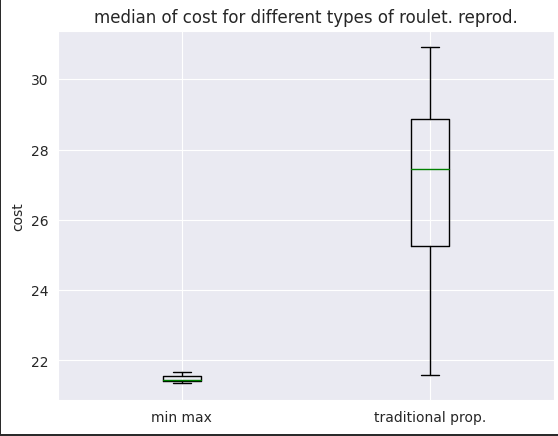
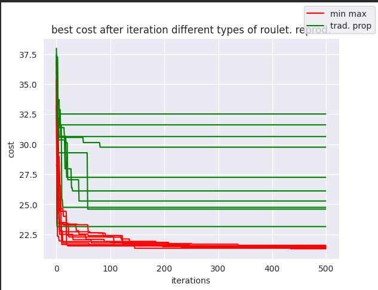

## Evolutionary algorithm

implmentation of evolutionary algorithm
- general implemntation with cost function and repodcution mechanism as params
- impact of **min max scaler in roulette reproduction**
- experiments about population size and mutation 

<!-- insert image -->
<!--  -->

## 

